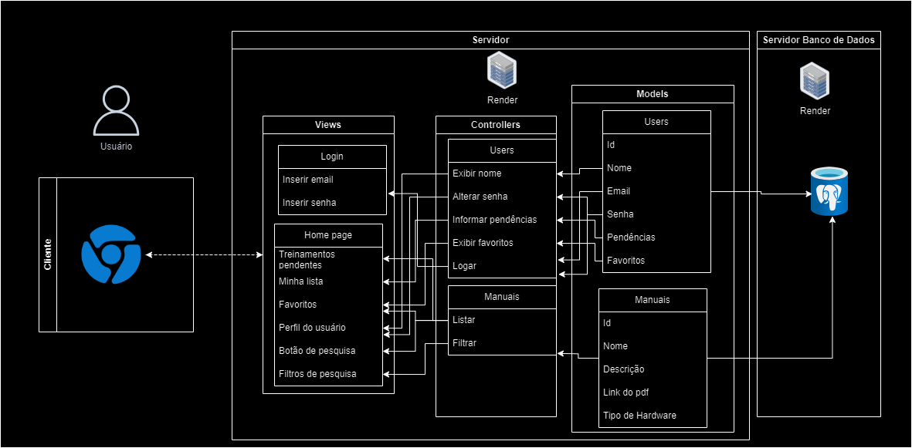

# EDELLCATION

## Descrição:

&nbsp;&nbsp;&nbsp;&nbsp;&nbsp;&nbsp;&nbsp;&nbsp;EDELLCATION é uma plataforma de apoio aos funcionários da Dell para que eles tenham um acesso rápido aos seus treinamentos. A proposta do grupo Dellta é que a plataforma funcione como uma “Netflix” de treinamentos da Dell, onde haveriam suas pendências, o catálogo de manuais e outras funcionalidades como favoritos e filtros de pesquisa. Como o projeto está em período de validação, ainda não é possível determinar como vai funcionar o administrador do site, então foi planejado apenas a questão do principal usuário, o montador.

## Arquitetura MVC

&nbsp;&nbsp;&nbsp;&nbsp;&nbsp;&nbsp;&nbsp;&nbsp;A arquitetura MVC (Model-View-Controller) é um padrão de projeto amplamente utilizado no desenvolvimento de software, especialmente em aplicações web. Com ela é possível  arquitetar o banco de dados do projeto, dando uma base aos desenvolvedores antes  do protótipo se iniciar.

<a>

### Modelos (Models)

**Users**
- ID: Chave primária
- Nome: Nome do funcionário
- Email: Email corporátivo do funcionário
- Senha: Senha de login do funcionário
- Pendências: Todos os treinamentos que foram selecionados para aquele funcionário
- Favoritos: Lista de favoritos do funcionário

**Manuais**

- ID: Chave primária
- Nome: Nome do manual
- Descrição: Descrição daquele conteudo
- Link do pdf: Link para o PDF do manual
- Tipo de Hardware: Tipo de Hardware que aparece naquele manual

## Controladores (Controllers)

**Users**
- Exibir Nome: Exibe o nome do funcionário no perfil do usuário. **Model:** Nome; **View:** Perfil do usuário 
- Alterar senha: Troca a senha do funcionário. **Model:** Senha; **View:** Perfil do usuário
- Informar pendências: Chama as pendências do usuário para exibi-las. **Model:** Pendências; **View:** Minha lista
- Exibir favoritos: Chama os favoritos do usuário para exibi-los. **Model:** Favoritos; **View:** Favoritos
- Logar: Valida as informações de email e senha do usuário. **Model:** Email e senha; **View:** Inserir email e Inserir senha

**Manuais**

- Listar: Busca pelas informações requisitadas pelo usuário. **Model:** Toda tabela Manuais; **View:** Minha lista, Favoritos e Botão de pesquisa
- Filtrar: Filtra as buscas, excluindo alguns resultados. **Model:** Toda tabela Manuais; **View:** Filtros de pesquisa

## Views

**Login**
- Inserir email: Campo para o usuário inserir o email
- Inserir senha: Campo para o usuário inserir a senha

**Home page**
- Treinamentos pendentes: Campo onde é possivel visualizar e acessar os treinamentos pendentes daquele funcionário
- Minha lista: A listagem de tudo que foi atribuido para aquele funcionário, inclusive o que já foi concluido
- Favoritos: A listagem de todos os itens favoritados pelo funcionário
- Perfil do usuário: O campo onde fica as informações de perfil daquele login
- Botão de pesquisa: Lugar onde é possivel buscar por mais treinamentos, além daqueles atribuidos
- Filtros de pesquisa: Filtros para ajudar com a pesquisa do usuário

## Infraestrutura

&nbsp;&nbsp;&nbsp;&nbsp;&nbsp;&nbsp;&nbsp;&nbsp;O Banco de dados vai funcionar utilizando as ferramentas Salils.js, PostgreSQL e DBeaver.

**Salis.js**
&nbsp;&nbsp;&nbsp;&nbsp;&nbsp;&nbsp;&nbsp;&nbsp;É um framework Node.js que facilita a construção de aplicativos da web e APIs RESTful, fornecendo estrutura e convenções para desenvolvimento rápido e escalável.

**PostgreSQL**
 &nbsp;&nbsp;&nbsp;&nbsp;&nbsp;&nbsp;&nbsp;&nbsp;É um sistema de gerenciamento de banco de dados relacional de código aberto, conhecido por sua confiabilidade, robustez e recursos avançados, como suporte a transações ACID e extensibilidade.

**DBeaver**
&nbsp;&nbsp;&nbsp;&nbsp;&nbsp;&nbsp;&nbsp;&nbsp;É uma ferramenta de gerenciamento de banco de dados universal e gratuita, que oferece uma interface gráfica para trabalhar com diversos bancos de dados, incluindo PostgreSQL, MySQL, Oracle, SQL Server, entre outros. Ele permite executar consultas, visualizar e modificar dados, gerenciar esquemas e muito mais.

## Justifique as escolhas feitas e como elas impactam o projeto

&nbsp;&nbsp;&nbsp;&nbsp;&nbsp;&nbsp;&nbsp;&nbsp;O modelo de organização do banco de dados é pensado utilizando as user stories, então a relação entre as tabelas é tudo que o usuário precisa receber, facilitando sempre seu trabalho, para que ele não precise pensar muito.

## Implicações da Arquitetura

**Escalabilidade**
&nbsp;&nbsp;&nbsp;&nbsp;&nbsp;&nbsp;&nbsp;&nbsp;A separação clara dos dados e da lógica de negócios facilita a escalabilidade do sistema, permitindo que o banco de dados seja otimizado independentemente da lógica da aplicação.

**Manutenção**
&nbsp;&nbsp;&nbsp;&nbsp;&nbsp;&nbsp;&nbsp;&nbsp;A separação da lógica permite que as alterações na interface do usuário sejam feitas independentemente da lógica de negócios ou controle.

**Testabilidade**
&nbsp;&nbsp;&nbsp;&nbsp;&nbsp;&nbsp;&nbsp;&nbsp;Os dados podem ser testadas para garantir que o fluxo seja executado corretamente conforme o que é fornecido pelo usuário.

**Reusabilidade**
&nbsp;&nbsp;&nbsp;&nbsp;&nbsp;&nbsp;&nbsp;&nbsp;Um aspecto que está estrutura de listas pode contribuir é na reusabilidade de controladores, já que o fluxo pode ser parecido em outras futuras telas.

